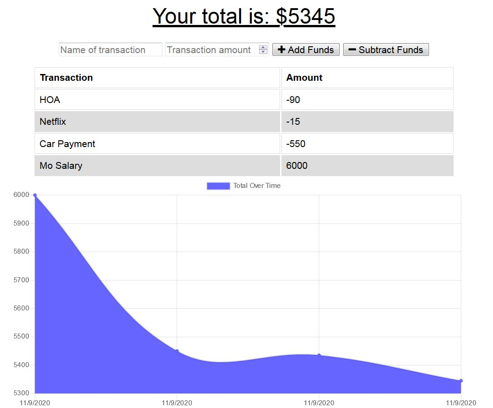

# Budget-Tracker

## Description

The Budget Tracker allows you to keep track of your positive or negative funds.  As you input each positive or negative fund your balance is tracked/plotted on a chart. and each time you track a fund it is added to the same line chart giving a visual of your budget.    You are also able to input your funds values while offline or not connected to the internet and as you gain internet access those values will then be automatically tracked.       

## Technologies
The Budget Tracker was created by utilizing mongoose to store the users input values of their funds.  Express was used for the api routing and webpack to bundle JavaScript files to use in the browser along with service-worker to cache files and the api. 

## Usage

Simply input the name of the transaction and its value, then click on Add Funds or Subtract Funds.  The value will then be plotted and as mroe values are added they will be plotted on the same chart.  If you are offline then simply repeat the same steps and as you gain internet access the values will be added to the tracker.  

## Budget-Tracker App Link
https://budget-tracker23.herokuapp.com

## Author
Joshua Guillen

### GitHub Profile: 
https://github.com/guillenjoshua

### Email Contact: 
guillenjoshua@gmail.com

## IMG

